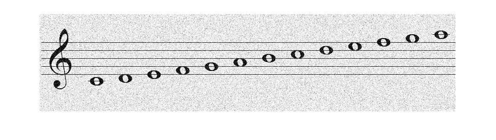
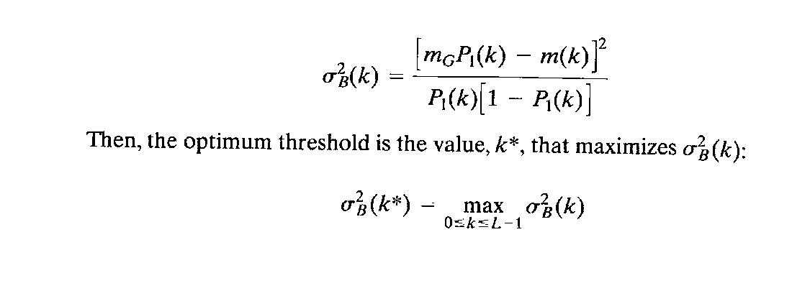
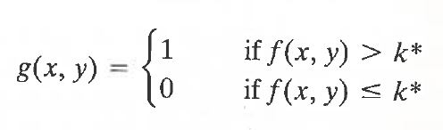
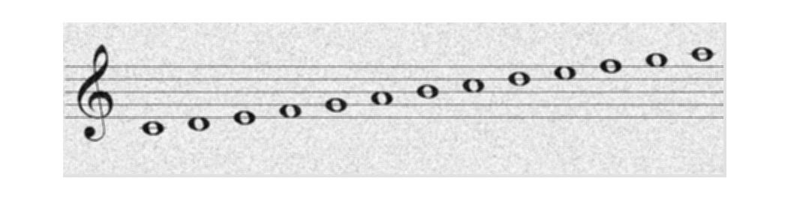

<h1>Music-Notes-Identifier</h1>
This program takes as input a low quality image of a music piece (a line starting by a music key followed by music notes), enhances the image and then compares it to the digital segmented music key/notes images

<h1>Helpers : </h1>
   
   <h4>Input :</h4>
   
   
   <h2> OTSU( image )</h2>
   <ul>
     <li>This function takes an image as an input</li>
     <li>It uses OTSU's algorithm to convert image to binary</li>
     
     
     <li>The output is a binary image where every pixel is either set to 0 or 255 </li>
   </ul>
   <h4>Output :</h4>
   

   <h2> mean_filter( image , filter_size )</h2>
   
"Implemented Not Used"

   <ul>
     <li>This function takes an image and a filter size value as an input</li>
     <li>It sets the value of each pixel to the mean value of the surrounding (filter_size * filter_size) pixels</li>
     <li>The output is a filtered image</li>
   </ul>
   <h4>Output :</h4>
   
   
   
   <h2> cut( image , start_point , end_point )</h2>
   <ul>
     <li>This function takes an image , start_point and an end_point as an input</li>
     <li>It crops the image so that the width of the image is (end_point - start_point) and the image starts at the starting_point on the original image</li>
     <li>The output is a cropped image</li>
   </ul>
   <h4>Output :</h4>
   
    

      
      

