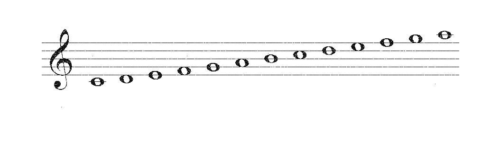

<h1>Music-Notes-Identifier</h1>
This program takes as input a low quality image of a music piece (a line starting by a music key followed by music notes), enhances the image and then compares it to the digital segmented music key/notes images

<h1>Helpers : </h1>
   <h2> remove_noise( image , min_dark )</h2>
   
"Implemented Not Used"

   <ul>
     <li>This function takes an image and a minimum darkness value as an input</li>
     <li>Pixels with value lower than the input value are set to white</li>
     <li>Pixels with value higher than the input value remain unchanged </li>
     <li>The output is a filtered image containing only the dark pixels</li>
   </ul>
   <h4>Input :</h4>
   
   <h4>Output :</h4>
   
    
   <h2> OTSU( image )</h2>
   <ul>
     <li>This function takes an image as an input</li>
     <li>It uses OTSU's algorithm to convert image to binary</li>
     
     
     <li>The output is a binary image where every pixel is either set to 0 or 255 </li>
   </ul>
   <h4>Input :</h4>
   
   <h4>Output :</h4>
   
      
      

